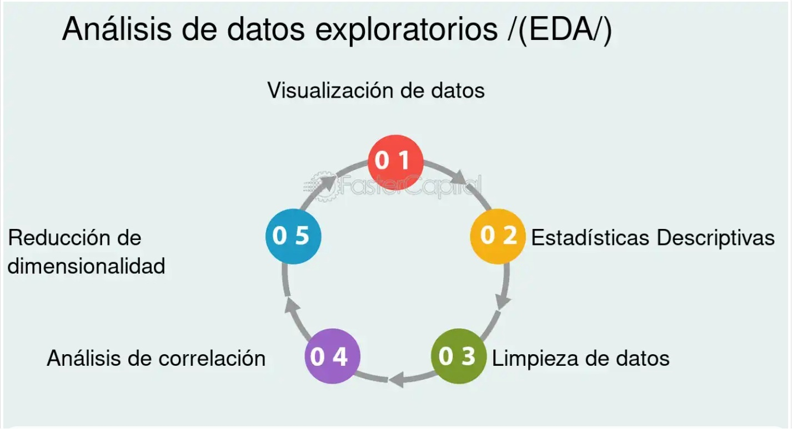

# 📝 Descripción del Proyecto

Tenemos una serie de datos de los que necesitamos sacar conclusiones para más adelante poder usarlos. En este caso, es importante mostrar ante nuestro CEO datos limpios y con sentido, para eso llevaremos a cabo un **Exploratory Data Analysis**.

# 📁 Estructura de carpetas

(assets/estructura.jpg)

# 🛠️ Tecnologías a usar

Requests
Pandas
Matplotlib, Pyplot, Seaborn, Bokeh

### 📦 Condiciones de entrega

Para el día de la entrega, se deberá presentar:

- Un **repositorio en GitHub** con al menos un **Jupyter Notebook** que contenga el análisis completo, ordenado en ramas y con mensajes de commit limpios.
- Un **informe ejecutivo** con las conclusiones obtenidas.